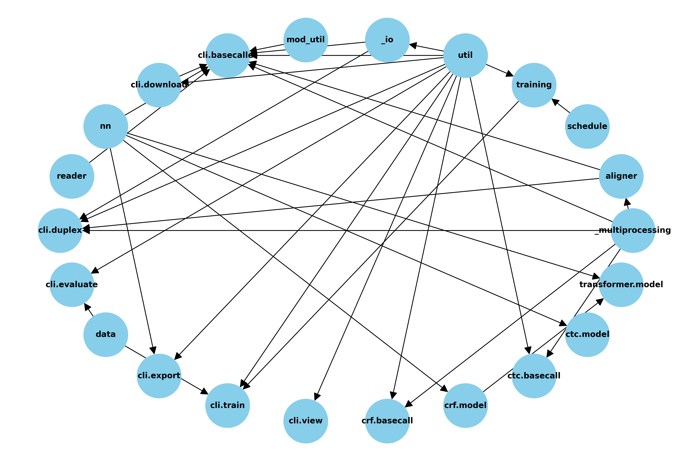

# NanoporeCaller: Base and Methyl Caller

## Goal:
- Create a customized neural-network model capable of differentiating between healthy and cancerous cells by determining methylation.

## Part 1: The Basics

This model will be able to interpret nanopore data. Our model will function by altering already pre-existing nanopore interpreters. These include Bonito(Python-based, simpler, more experimental) and Dorado(C++ based, more complex, dependable/well-tested). Our end goal would be to repurpose the more complex Dorado. However, in order to familiarize ourselves with the processes involved in this software, we will begin with Bonito. Unlike this already existing software, rather than just being able to basecall nanopore squiggle data, this model will additionally be able to tell the difference between methylated and un-methylated regions. This requires a high degree of certainty in order to understand whether each base pair is methylated. Ultimately, this model will take a nanopore file(sfast5,pod5) and perform basecalling with additional methylation detection and, similar to Bonito and Dorado, will produce output files (BAM, SAM, CRAM). 

For example, pod5 files were parsed by using the pod5 package in Python. This allowed us to get more acquainted with the file format and understand how the separate pod5 files were organized. 

## Part 2: Gathering Data

To begin training a model and testing the Bonito model, genomic data needed to be gathered. This would preferably have several different sequence data types of the same samples to compare the resulting basecall. Looking at the [Epi2me Labs website](https://labs.epi2me.io/giab-2023.05/), the developers of Bonito and Dorado list several types of datasets that are heavily sampled. The Genome in a Bottle data was selected. The data from the GIAB consortium contains genomic data from four different individuals. For each sample, several whole genomic data types are included, most importantly, fast5 files.

There were issues accessing the stored data using the AWS Command Line Interface (AWS CLI). I found it difficult to access these databases, as a result of the commands being slightly different from normal bash commands. Directories are requested and returned rather than connecting and searching through the database. The following commands were used:

Directories were requested like so:
```bash
$ aws s3 ls --no-sign-request s3://ont-open-data/colo829_2024.03/basecalls/colo829/hac/
```

Files in were copied like so:
```bash
$ aws s3 cp --no-sign-request --recursive s3://ont-open-data/gm24385_2020.09/ /Users/xavierroy/Downloads
```


#### Potential Dataset: Human Pangenome Reference Consortium

The [Human Pangenome Reference Consortium (HPRC)](https://humanpangenome.org) aims to create a comprehensive reference genome that captures the full genetic diversity of human populations worldwide. It includes genetic sequences from diverse groups. This initiative utilizes advanced technologies to construct and maintain the pangenome reference, benefiting research and clinical applications by providing a more robust tool for studying human genetics.

A portion of the data can be accessed via a AWS bucket as well: aws s3 ls --no-sign-request s3://human-pangenomics/NHGRI_UCSC_panel/ 

[Repo Explaining Data](https://github.com/human-pangenomics/HG002_Data_Freeze_v1.0)

## Part 3: Setting up Bonito
    
Bonito was downloaded and run as described in the workflow below:

1. First load Miniconda module
```bash
module load miniconda
```

For this next step I had a difficult time finding out how to move my conda environments outside of my local directory. The genomic files stored in the Bonito directory whithin in the created environment would easily surpass the disk space limit of 10GB.

2. Go to the home directory and edit your conda configuration file (.condarc) file so that envs_dirs and pkgs_dirs have a pathway that leads to a .conda directory that leads to a directory within the lab project folder. This should be within the /restricted/projectnb/leshlab directory. Notice that original pathways are commented out:

.condarc example:
```bash
envs_dirs:
  - /restricted/projectnb/leshlab/net/xroy/.conda/envs
 # - ~/.conda/envs
pkgs_dirs:
  - /restricted/projectnb/leshlab/net/xroy/.conda/pkgs
 # - ~/.conda/pkgs
env_prompt: ({name})
channels:
  - conda-forge
  - defaults
channel_priority: strict
report_errors: true
```

3. Next create a conda environment with Python module.
```bash
conda create env -n bonito_env python=3.10 #Note: current version of bonito is compatible with python 3.8-3.11, may change in future.
```

4. Activate new environment in order to enter it.
```bash
conda activate env bonito_env
```

5. Redirect pip installation pathway to your conda environment using alias pip, like so:
```bash
alias pip=/restricted/projectnb/leshlab/net/xroy/.conda/envs/bonito_module/bin/pip
```

6. Next use pip to install bonito and upgrade pip if not already done. In theory, all dependencies should automatically be solved, however, nothing can be simple.
```bash
pip install --upgrade pip
pip install ont-bonito
```

If you receive dependency errors like:

> ERROR: pip's dependency resolver does not currently take into account all the packages that are installed. This behavior is the source of the following dependency conflicts.
> ipywidgets 8.0.7 requires widgetsnbextension~=4.0.7, which is not installed.
> botocore 1.31.3 requires urllib3<1.27,>=1.25.4, but you have urllib3 2.2.1 which is incompatible.

You may have to manually solve dependency issues by installing the specified versions of these Python packages. It may be easier to use "pip uninstall {package name}" and rerun "pip install ont-bonito" so that pip can start fresh and download the compatible versions of each package.

7. Bonito package should now be located in this directory within the .conda file, in your created environment library:
```bash
cd .conda/envs/bonito_env/lib/python3.10/site-packages/bonito/
```

8. Download example data:
```bash
bonito download --models   # download all available models
bonito download --training # download training data examples
```

## Part 4: Understanding Bonito File Interaction

### Schema of Bonito File Interaction:


Figure 1: Many Python files present in Bonito are personalized versions of already existing Python modules. As shown in the image above, many files are called within cli.basecaller.py and many files pull from util.py.

### Looking into file configurations:
Format of Pod5 files were explored using the python package pod5, allowing for conceptualizating of the type of data stored in a pod5 file.


#### Training:


## Part 5: Running Bonito

### Data Generation
Data was gathered using data from Epi2me's ont-open-data aws bucket. At first, data was gathered from the GIAB (Genome in a Bottle) consortium. However, there was an issue when attempting to generate the CTC data required to train a model. The operation would be halted after base-reading 71% of the nanopore dataset. As a result of no aborting status being returned from SCC, at first, it was thought that the typical basecalling files were all that was needed for model training. However, after looking through the error files it was found that the operation was halted. This was a result of a Bonito error going undetected as a result of no error being raised by SCC. This was thought to be a result of the download process being interrupted.

The reason for this error was unknown, so a single nanopore data file was used to attempt to generate CTC training data. This resulted in training data being halted as well.

To see the format of the output, the operation was used on the [Tumor Pair Benchmark Dataset](https://labs.epi2me.io/colo-2024.03/) from the same Epi2me AWS bucket. This time the data was downloaded using a qsub command, resulting in the process taking around seven hours to download all nanopore data for this dataset. This data was then used to successfully generate CTC data for training. This resulted in the standard basecalling files along with three additional .npy files. This served as an experimental. This smaller dataset allowed for the training data to be generated without excessive resource consumption.

Training data was then attempted to be generated with pod5 files from the genome in a bottle dataset. However, due to issues with limited ram and limited disk space in the project directory, this operataion was halted several times. After increasing disk space and ram for the submission. The sample ran successfully.
